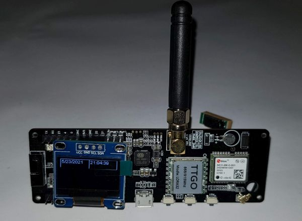

# LILYGO TTGO T Beam
I wrote some small test programms for all parts of the T-Beam

## The following program are included

LoraReceiver

LoraSender

DisplayTest

GPSTest

ButtonTest

BatteryStatusTest

BatteryStatusDisplay

## Used Libs

https://github.com/sandeepmistry/arduino-LoRa

https://github.com/ThingPulse/esp8266-oled-ssd1306 

https://github.com/knolleary/pubsubclient

https://github.com/mikalhart/TinyGPSPlus

https://github.com/lewisxhe/AXP202X_Library

## Credits
Created by S. Fambach visit https://www.fambach.net if you want

